# Slide Verification

[简体中文](README.zh-CN.md)

Slide Verification is a focused Python example that opens the DingXiang slider-CAPTCHA demo, captures the current challenge, finds the correct slot with OpenCV, and drags the real slider handle with DrissionPage.

The detector is designed for the behavior observed in the demo: multiple objects may resemble the piece, but the genuine slot is the dimmest object among candidates that match the piece contour. Shape qualification always happens before brightness ranking.

> [!IMPORTANT]
> Use this project only on systems you own or are authorized to test. CAPTCHA automation may violate a site's terms or access policy. The selectors and assumptions in this repository target the public DingXiang demonstration page, not arbitrary production systems.

## Features

- Captures the CAPTCHA canvas directly with `canvas.toDataURL()`.
- Downloads the current transparent puzzle-piece image.
- Removes the piece's neon-green glow before matching its real contour.
- Uses OpenCV template matching for fast candidate localization.
- Uses OpenCV contour matching to reject unrelated dark scene objects.
- Selects the dimmest qualified contour when same-shaped decoys exist.
- Converts natural canvas coordinates into rendered browser coordinates.
- Drags the SDK's actual handle with an eased path and verifies its real DOM displacement.
- Includes site-independent synthetic regression tests.

## Requirements

- Windows, macOS, or Linux with a graphical Chromium/Chrome installation
- Python 3.13 or newer
- [`uv`](https://docs.astral.sh/uv/)
- Network access to `https://www.dingxiang-inc.com/demo/captcha`

The Python dependencies are managed by `uv`:

- DrissionPage for Chromium automation
- OpenCV Headless for image processing and shape matching
- NumPy for arrays and drag-path generation

OpenCV is installed without GUI modules because the browser displays the UI; the detector does not call `cv2.imshow()`.

## Installation

Clone the repository and synchronize the locked environment:

```bash
git clone <repository-url>
cd slide-verification
uv sync
```

`uv sync` installs the exact dependency versions recorded in `uv.lock` and creates `.venv` when necessary.

## Usage

Run the browser workflow from the repository root.

Windows PowerShell:

```powershell
uv run .\slide-verification.py
```

macOS or Linux:

```bash
uv run ./slide-verification.py
```

Keep the physical mouse pointer outside the automated browser tab until the attempt finishes. The DingXiang panel is hover-driven, and real mouse events can close the panel or override the synthetic drag.

A successful run prints output similar to:

```text
IMPORTANT: Keep your mouse pointer outside the browser tab until the slider attempt finishes; physical mouse movement overrides the DrissionPage mouse automation.
piece bbox in img: x 1..65, y 7..59
expected hole: 64x52 natural px
gap_left = 184
gap left: 184 natural px -> drag distance 127.3 px
dragged slider 128.0 px
verification succeeded: 验证成功
```

Runtime captures are written to `saved_img/` for inspection. This directory is ignored by Git. The background filename is overwritten on each run, while DrissionPage may suffix subsequent piece filenames.

## Architecture

```mermaid
flowchart LR
    A[Open demo page] --> B[Hover CAPTCHA trigger]
    B --> C[Capture canvas and piece]
    C --> D[Measure rendered geometry]
    D --> E[OpenCV detection]
    E --> F[Convert canvas x to screen distance]
    F --> G[Arm result observer]
    G --> H[Press and drag real handle]
    H --> I[Verify DOM displacement]
    I --> J[Wait for SDK terminal state]
```



The project is intentionally small:

| File | Responsibility |
| --- | --- |
| `slide-verification.py` | Browser orchestration, DOM lookup, capture, scale conversion, and error reporting |
| `gap_detect.py` | Piece geometry, OpenCV detection, candidate selection, and verified drag motion |
| `verification_detect.py` | Page-side result observer, terminal-state normalization, polling, and timeout handling |
| `test_gap.py` | Synthetic detector and drag regressions that do not access the live site |
| `test_verification.py` | Offline success, rejection, load-error, reset, and timeout regressions |
| `pyproject.toml` / `uv.lock` | Python metadata and reproducible dependencies |

`slide-verification.py` owns site-specific orchestration. `gap_detect.py` contains the reusable image and motion computation, while `verification_detect.py` isolates post-drag browser state. Keeping these responsibilities separate allows nearly all behavior to be tested without Chromium or network access.

## Detection Strategy

### 1. Capture and geometry

The browser script captures the 400×200 natural canvas as PNG and downloads the 68×68 piece image. It finds the inclusive bounding box of pixels whose alpha value is greater than `10`.

The piece may be rendered at a different CSS size from the canvas, so the expected natural slot dimensions are calculated from the browser rectangles:

```text
canvas_scale = rendered_canvas_width / 400

expected_width =
    rendered_piece_width × opaque_bbox_width / 68 / canvas_scale

expected_height =
    rendered_piece_height × opaque_bbox_height / 68 / canvas_scale
```

These dimensions remove the need for an expensive scale search during matching.

### 2. Build the inner slot template

The downloaded piece contains a bright green border and glow that is wider than the actual slot. Matching the raw alpha boundary causes oversized templates and false matches against unrelated scene edges.

The detector therefore:

1. Loads the piece with `cv2.IMREAD_UNCHANGED`.
2. Thresholds its alpha channel.
3. Crops to the opaque bounding box.
4. Resizes the mask with nearest-neighbor interpolation.
5. Erodes the mask with an elliptical kernel to remove the glow.
6. Extracts the inner outline with `cv2.morphologyEx(..., MORPH_GRADIENT)`.
7. Extracts the largest external contour as the reference shape.

The glow erosion radius is `5.5%` of the smaller expected dimension, with a minimum of two pixels.

### 3. Fast edge-template localization

The background is converted to grayscale. OpenCV Sobel filters calculate horizontal and vertical gradients, and `cv2.magnitude` produces a normalized edge-strength image.

`cv2.matchTemplate(..., TM_CCORR_NORMED)` correlates the inner outline with every valid background position in native code. This replaces the previous nested Python sliding-window loop.

Candidates must satisfy both conditions:

- Normalized score of at least `0.25`
- Score of at least `60%` of the best score in the image

OpenCV dilation produces the local-maximum map, and connected components collapse plateaus into one peak. The suppression neighborhood is approximately half the piece dimensions, preventing adjacent offsets of the same object from being treated as separate objects.

### 4. Contour-shape qualification

Edge strength alone is insufficient: a dark pepper, branch, or product edge can overlap the sparse outline template and receive a high correlation score.

The detector uses a second, independent OpenCV strategy:

1. Gaussian-blur the background.
2. Compute adaptive Canny thresholds from the image median.
3. Close small edge gaps with morphological closing.
4. Extract contours with `cv2.findContours`.
5. Reject contours whose size or area is implausible for the expected piece.
6. Compare each remaining contour to the piece with `cv2.matchShapes(..., CONTOURS_MATCH_I1)`.

Each template peak is associated with its best contour. Multiple peaks that overlap the same physical contour are grouped, and only the strongest localization survives. Shape distances must be no greater than `0.15`, or three times the best distance when that is more permissive.

This stage is what prevents arbitrary dark scenery from winning merely because it is dark.

### 5. Brightness ranking

The demo may render a brighter decoy with nearly the same outline as the genuine slot. After template and contour qualification, the detector fills each matched contour and calculates its grayscale mean with `cv2.mean`.

The candidate with the lowest mean brightness wins. Template score is the deterministic tie-breaker.

Brightness never qualifies a shape by itself; it only ranks candidates that already pass both matching stages.

### 6. Coordinate conversion

`find_gap_left()` returns the natural-canvas x-coordinate that aligns the piece's outer bounding box. The browser script converts it to screen coordinates:

```text
gap_left_screen = canvas_left + gap_left × canvas_scale

piece_left_screen =
    piece_element_left + opaque_bbox_x / 68 × rendered_piece_width

drag_distance = gap_left_screen - piece_left_screen
```

Using the opaque-piece offset is important because the 68×68 source image often contains transparent padding.

## Drag Strategy

The floating puzzle image is not the SDK's drag target. The script presses the instance-specific handle:

```css
#dx_captcha_basic_slider_3
```

`drag_slider()` then:

1. Moves to the handle center.
2. Dispatches mouse-down on the handle.
3. Generates 18 ease-in/ease-out horizontal steps.
4. Adds a small sinusoidal vertical path that returns to zero rather than accumulating drift.
5. Measures the handle's DOM x-coordinate before mouse-up.
6. Rejects the attempt if actual movement differs by more than two pixels or 2%.
7. Releases the mouse in a `finally` block so exceptions cannot leave it pressed.

The displacement check distinguishes a completed drag from a panel closed by a physical mouse event.

## Success Detection Strategy

Moving the handle to the requested coordinate only proves that the input was delivered. It does not prove that DingXiang accepted the attempt. The SDK submits behavior and challenge data to its verification service after mouse-up, then renders a terminal state.

Immediately before dragging, `arm_verification_detection()` installs a `MutationObserver` on the current CAPTCHA trigger. It watches class, style, child, and text changes and samples:

- The basic challenge bar and the outer one-click bar for `dx-success`
- The failure bar or `dx-fail`/`dx-error` state
- The load-error message separately from a rejected attempt
- The visible localized message, such as `验证成功` or `验证未通过`

The observer retains the first terminal snapshot. This matters because a rejected challenge can refresh quickly; ordinary Python polling could otherwise see only the subsequent neutral state. After the drag, Python polls the retained state every 50 ms for up to 10 seconds and returns one of `success`, `failure`, or `load_error`. A missing terminal transition raises `VerificationTimeoutError`, and the page-side observer is disconnected on every exit path.

This rendered-state approach is specific to automating the public demo. In an application that initializes its own DingXiang CAPTCHA instance, prefer the SDK's official `verifySuccess` and `verifyFail` events and consume the success token.

## Public API

The reusable functions live in `gap_detect.py`:

```python
from pathlib import Path

from gap_detect import (
    GapNotFoundError,
    drag_slider,
    find_gap_left,
    piece_geometry,
)

geometry = piece_geometry(Path("piece.webp"))
gap_x = find_gap_left(
    Path("background.png"),
    Path("piece.webp"),
    expected_width=60,
    expected_height=58,
)
```

### `piece_geometry(piece_path)`

Returns `(x0, y0, x1, y1)` with inclusive maximum coordinates. It raises `GapNotFoundError` when no opaque pixels exist.

### `find_gap_left(bg_path, piece_path, expected_width, expected_height)`

Returns the natural-canvas alignment x-coordinate as an integer. It raises `GapNotFoundError` for undecodable images, empty masks, missing edges, weak template matches, or the absence of a compatible closed contour.

### `drag_slider(tab, handle, distance, duration=0.9)`

Drags the supplied DrissionPage handle and returns its measured horizontal displacement. Invalid distances raise `ValueError`; interrupted or overridden drags raise `RuntimeError`.

The post-drag API lives in `verification_detect.py`:

```python
from verification_detect import (
    VerificationStatus,
    arm_verification_detection,
    wait_for_verification_result,
)

initial = arm_verification_detection(captcha_root)
assert initial.status is VerificationStatus.PENDING

# Perform the drag here.
result = wait_for_verification_result(captcha_root, timeout=10)
if result.status is VerificationStatus.SUCCESS:
    print(result.message)
```

The observer must be armed before mouse-up so brief rejection states are retained. `wait_for_verification_result()` disconnects it after a terminal result or timeout.

## Testing

Run both offline regression scripts:

```bash
uv run ./test_gap.py
uv run ./test_verification.py
```

On Windows, this form is equivalent:

```powershell
uv run .\test_gap.py
uv run .\test_verification.py
```

The suite covers:

- A known dimmed slot
- A background with no slot
- An outline-only slot
- A brighter same-shaped decoy
- An oversized green glow plus strong unrelated scene edges
- A slot close to a canvas boundary
- Undecodable input and an empty alpha mask
- Exact drag target, displacement, release, and zero final vertical drift
- Success and failure UI states
- CAPTCHA load errors
- Retention of a brief failure across an automatic widget reset
- Result polling, timeout, and observer cleanup

Compile-check the modules with:

```bash
uv run python -m compileall -q gap_detect.py verification_detect.py slide-verification.py test_gap.py test_verification.py
```

On the development machine, the OpenCV detector has a warmed median around 18 ms for a 400×200 challenge, compared with roughly 1.5–2.1 seconds for the previous Python sliding-window implementation. Timings vary by hardware and image contents.

## Troubleshooting

| Symptom | Likely cause | Action |
| --- | --- | --- |
| CAPTCHA panel disappears | Physical mouse entered or left the hover-driven panel | Keep the pointer outside the browser tab and retry |
| `slider did not follow the automated pointer` | Real input overrode DrissionPage or the panel closed | Do not move the mouse; rerun after the page settles |
| `not solved: failure` | The service rejected the submitted position or behavior | Retry with a fresh challenge; inspect the detected distance if failures repeat |
| `CAPTCHA did not report success or failure` | The SDK never rendered a terminal state within 10 seconds | Check network requests and inspect whether DingXiang changed its result classes |
| `not solved: load_error` | The CAPTCHA SDK could not load or verify the challenge | Check connectivity, rate limits, and the demo service status |
| `no matching piece contour found` | Weak/unsupported visual variant or incorrect dimensions | Inspect the latest files in `saved_img/` and verify the canvas/piece constants |
| `no closed background contour matches the piece` | Slot edge is fragmented or site styling changed | Review Canny/morphology thresholds and the captured image |
| Wrong object is selected | A new decoy passes both shape filters and is darker | Add the capture as a regression and adjust shape qualification before brightness logic |
| Element timeout or missing `_3` selector | The demo DOM or CAPTCHA instance numbering changed | Update selectors in `slide-verification.py` |
| Chromium does not launch/connect | Missing browser or stale DrissionPage configuration | Confirm a compatible Chromium installation and recreate `.venv` with `uv sync` |

## Maintenance and Extension

The most important invariants are declared as named constants near the top of `gap_detect.py`. When tuning detection:

1. Preserve the ordering: template match, contour match, then brightness.
2. Add or generate a regression case before changing a threshold.
3. Benchmark after changes; avoid reintroducing per-pixel Python loops.

When DingXiang changes its rendered DOM, update the selectors and state classes in the page-side observer together with `test_verification.py`. If this code is adapted to a site where the CAPTCHA instance is available, replace DOM observation with the official SDK result events.
4. Keep natural-canvas coordinates separate from rendered screen coordinates.
5. Revalidate live selectors whenever the demo SDK changes.

Rotation and unconstrained scale search are intentionally out of scope. The caller supplies the expected dimensions, and DingXiang serves the piece in the same orientation as its slot. Supporting another provider should normally involve a new browser adapter while reusing or separately configuring the detector.
