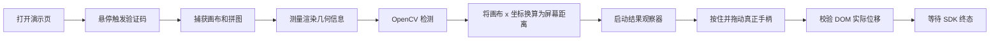

# 滑块验证示例

[English](README.md)

Slide Verification 是一个专注的 Python 示例项目：它会打开顶象滑块验证码演示页，捕获当前挑战，使用 OpenCV 定位正确缺口，并通过 DrissionPage 拖动真正的滑块手柄。

检测器针对演示页已经观察到的规律设计：背景中可能存在多个形似拼图的干扰物，但真正缺口一定是轮廓匹配候选中更暗的那个。因此，系统始终先验证形状，再比较亮度。

> [!IMPORTANT]
> 请仅在自己拥有或明确获准测试的系统上使用本项目。自动化验证码可能违反网站的服务条款或访问策略。本仓库中的选择器和假设只针对公开的顶象演示页，并不面向任意生产系统。

## 功能特性

- 通过 `canvas.toDataURL()` 直接捕获验证码画布。
- 下载当前带透明通道的拼图图片。
- 匹配前移除拼图外围的荧光绿色描边和光晕。
- 使用 OpenCV 模板匹配快速定位候选区域。
- 使用 OpenCV 轮廓匹配排除无关的深色背景物体。
- 多个同形干扰项存在时，选择最暗的合格轮廓。
- 将画布自然坐标转换为浏览器渲染坐标。
- 拖动 SDK 真正的手柄，并校验 DOM 中的实际位移。
- 提供不依赖网站和浏览器的合成回归测试。

## 环境要求

- Windows、macOS 或 Linux，以及可用的图形化 Chromium/Chrome
- Python 3.13 或更高版本
- [`uv`](https://docs.astral.sh/uv/)
- 能访问 `https://www.dingxiang-inc.com/demo/captcha` 的网络

Python 依赖由 `uv` 管理：

- DrissionPage：Chromium 自动化
- OpenCV Headless：图像处理与形状匹配
- NumPy：数组计算与拖动轨迹生成

项目使用无 GUI 的 OpenCV，因为界面由浏览器展示，检测器不会调用 `cv2.imshow()`。

## 安装

克隆仓库并同步锁定环境：

```bash
git clone <repository-url>
cd slide-verification
uv sync
```

`uv sync` 会安装 `uv.lock` 中记录的精确依赖版本，并在需要时创建 `.venv`。

## 使用方法

在仓库根目录运行浏览器流程。

Windows PowerShell：

```powershell
uv run .\slide-verification.py
```

macOS 或 Linux：

```bash
uv run ./slide-verification.py
```

在执行完成前，请把物理鼠标指针移出自动化浏览器标签页。顶象面板依赖悬停状态，真实鼠标事件可能关闭面板或覆盖自动拖动。

成功执行时会输出类似内容：

```text
IMPORTANT: Keep your mouse pointer outside the browser tab until the slider attempt finishes; physical mouse movement overrides the DrissionPage mouse automation.
piece bbox in img: x 1..65, y 7..59
expected hole: 64x52 natural px
gap_left = 184
gap left: 184 natural px -> drag distance 127.3 px
dragged slider 128.0 px
verification succeeded: 验证成功
```

运行时截图保存在 `saved_img/` 目录中，便于排查问题。该目录已被 Git 忽略。背景文件每次运行都会覆盖，DrissionPage 可能会为后续拼图文件自动添加编号后缀。

## 总体架构



项目结构刻意保持精简：

| 文件 | 职责 |
| --- | --- |
| `slide-verification.py` | 浏览器编排、DOM 查询、截图、缩放换算和错误输出 |
| `gap_detect.py` | 拼图几何计算、OpenCV 检测、候选选择和经校验的拖动动作 |
| `verification_detect.py` | 页面结果观察、终态归一化、轮询和超时处理 |
| `test_gap.py` | 不访问真实网站的合成检测与拖动回归测试 |
| `test_verification.py` | 离线验证成功、拒绝、加载错误、重置和超时回归测试 |
| `pyproject.toml` / `uv.lock` | Python 项目元数据和可复现依赖 |

`slide-verification.py` 负责网站相关的流程编排；`gap_detect.py` 包含可复用的图像与动作计算；`verification_detect.py` 隔离拖动后的浏览器状态判断。这样的职责划分让绝大多数行为都能在没有 Chromium 和网络的环境中测试。

## 检测策略

### 1. 图像捕获与几何计算

浏览器脚本将自然尺寸为 400×200 的画布捕获为 PNG，并下载 68×68 的拼图图片。透明通道值大于 `10` 的像素会被视为不透明像素，系统据此计算包含最大坐标的包围盒。

拼图元素和画布可能使用不同的 CSS 渲染尺寸，因此预期缺口自然尺寸由浏览器矩形计算：

```text
canvas_scale = 画布渲染宽度 / 400

expected_width =
    拼图渲染宽度 × 不透明包围盒宽度 / 68 / canvas_scale

expected_height =
    拼图渲染高度 × 不透明包围盒高度 / 68 / canvas_scale
```

检测器由调用方提供尺寸，因此不需要在匹配阶段执行昂贵的尺度搜索。

### 2. 构建内部缺口模板

下载的拼图带有比真实缺口更宽的绿色边框和光晕。直接匹配原始透明边界会放大模板，使无关背景边缘被误判为候选。

检测器会执行以下处理：

1. 使用 `cv2.IMREAD_UNCHANGED` 加载拼图。
2. 对透明通道做阈值处理。
3. 裁剪到不透明像素包围盒。
4. 使用最近邻插值缩放遮罩。
5. 使用椭圆核腐蚀遮罩，移除绿色光晕。
6. 使用 `cv2.morphologyEx(..., MORPH_GRADIENT)` 提取内部边界。
7. 提取最大的外部轮廓作为参考形状。

光晕腐蚀半径为较小预期尺寸的 `5.5%`，最少为两个像素。

### 3. 快速边缘模板定位

背景会被转换为灰度图。OpenCV Sobel 滤波器分别计算水平和垂直梯度，再由 `cv2.magnitude` 生成归一化边缘强度图。

`cv2.matchTemplate(..., TM_CCORR_NORMED)` 在原生代码中将内部边界与所有有效背景位置做相关计算，替代原先的 Python 双层滑动窗口。

候选必须同时满足：

- 归一化得分至少为 `0.25`
- 得分至少达到当前图像最佳得分的 `60%`

OpenCV 膨胀操作用于生成局部极大值图，连通组件会把平台区域合并成一个峰值。抑制邻域约为拼图尺寸的一半，避免同一物体的相邻偏移被重复计为多个物体。

### 4. 轮廓形状验证

只有边缘强度仍不够可靠：辣椒、树枝或商品边缘可能刚好覆盖稀疏模板，从而获得较高相关分。

检测器会执行第二套独立的 OpenCV 验证：

1. 对背景做高斯模糊。
2. 根据图像中位数计算自适应 Canny 阈值。
3. 通过形态学闭运算连接小的边缘缺口。
4. 使用 `cv2.findContours` 提取轮廓。
5. 按预期拼图大小过滤尺寸或面积不合理的轮廓。
6. 使用 `cv2.matchShapes(..., CONTOURS_MATCH_I1)` 与拼图轮廓比较。

每个模板峰值会关联到最匹配的轮廓。覆盖同一个实际轮廓的多个峰值会被分组，只保留定位分最高的一个。形状距离不得超过 `0.15`；当最佳距离的三倍更宽松时，则使用该相对阈值。

这一阶段可以防止无关的深色背景仅仅因为“更暗”而胜出。

### 5. 亮度排序

演示页可能生成轮廓几乎相同、但亮度更高的干扰项。模板和轮廓验证完成后，检测器会填充每个匹配轮廓，并使用 `cv2.mean` 计算灰度均值。

灰度均值最低的候选被选中，模板匹配分用于确定性地处理并列情况。

亮度不会单独决定某个区域是否为缺口；它只对已经通过两层形状验证的候选排序。

### 6. 坐标转换

`find_gap_left()` 返回用于对齐拼图外部包围盒的画布自然 x 坐标。浏览器脚本将其转换为屏幕坐标：

```text
gap_left_screen = 画布左边界 + gap_left × canvas_scale

piece_left_screen =
    拼图元素左边界 + 包围盒 x / 68 × 拼图渲染宽度

drag_distance = gap_left_screen - piece_left_screen
```

必须使用不透明区域偏移，因为 68×68 原图经常带有透明留白。

## 拖动策略

浮动拼图图片并不是 SDK 的拖动目标。脚本会按住指定验证码实例的真实手柄：

```css
#dx_captcha_basic_slider_3
```

`drag_slider()` 的流程如下：

1. 将指针移动到手柄中心。
2. 在手柄上发送鼠标按下事件。
3. 生成 18 段缓入缓出的水平轨迹。
4. 添加最终回到零点的轻微正弦垂直轨迹，避免累计漂移。
5. 释放前读取手柄的 DOM x 坐标。
6. 当实际位移与目标相差超过两个像素或 2% 时判定失败。
7. 在 `finally` 中释放鼠标，避免异常后保持按下状态。

位移校验可以区分真正完成的拖动和被物理鼠标事件关闭的面板。

## 成功检测策略

手柄到达目标坐标只能证明输入动作已执行，不能证明顶象接受了本次验证。鼠标释放后，SDK 会把行为和挑战数据提交到验证服务，再渲染最终状态。

拖动前，`arm_verification_detection()` 会在当前验证码触发器上安装 `MutationObserver`，监听 class、style、子节点和文本变化，并采样：

- 基础挑战栏和外层一键验证栏中的 `dx-success`
- 失败栏或 `dx-fail`/`dx-error` 状态
- 与验证拒绝分开处理的加载错误
- 当前可见的本地化消息，例如 `验证成功` 或 `验证未通过`

观察器会保留第一个终态快照。这一点很重要，因为验证被拒后组件可能迅速刷新；仅依靠普通 Python 轮询可能只能看到刷新后的中性状态。拖动结束后，Python 每 50 毫秒读取一次保留状态，最长等待 10 秒，结果为 `success`、`failure` 或 `load_error`。没有出现终态时抛出 `VerificationTimeoutError`，且任何退出路径都会断开页面观察器。

这种渲染状态方案用于自动化公开演示页。如果业务代码能够取得自己初始化的顶象验证码实例，应优先使用 SDK 官方的 `verifySuccess` 和 `verifyFail` 事件，并消费成功 token。

## 公共 API

可复用函数位于 `gap_detect.py`：

```python
from pathlib import Path

from gap_detect import (
    GapNotFoundError,
    drag_slider,
    find_gap_left,
    piece_geometry,
)

geometry = piece_geometry(Path("piece.webp"))
gap_x = find_gap_left(
    Path("background.png"),
    Path("piece.webp"),
    expected_width=60,
    expected_height=58,
)
```

### `piece_geometry(piece_path)`

返回 `(x0, y0, x1, y1)`，其中最大坐标为包含式。没有不透明像素时抛出 `GapNotFoundError`。

### `find_gap_left(bg_path, piece_path, expected_width, expected_height)`

返回整数形式的画布自然对齐 x 坐标。图像无法解码、遮罩为空、背景缺少边缘、模板匹配过弱或没有兼容闭合轮廓时，会抛出 `GapNotFoundError`。

### `drag_slider(tab, handle, distance, duration=0.9)`

拖动传入的 DrissionPage 手柄并返回测得的水平位移。无效距离抛出 `ValueError`；被中断或覆盖的拖动抛出 `RuntimeError`。

拖动后状态 API 位于 `verification_detect.py`：

```python
from verification_detect import (
    VerificationStatus,
    arm_verification_detection,
    wait_for_verification_result,
)

initial = arm_verification_detection(captcha_root)
assert initial.status is VerificationStatus.PENDING

# 在此执行拖动。
result = wait_for_verification_result(captcha_root, timeout=10)
if result.status is VerificationStatus.SUCCESS:
    print(result.message)
```

观察器必须在鼠标释放前启动，才能保留短暂出现的拒绝状态。`wait_for_verification_result()` 会在得到终态或超时后断开观察器。

## 测试

运行两个离线回归脚本：

```bash
uv run ./test_gap.py
uv run ./test_verification.py
```

Windows 下也可使用：

```powershell
uv run .\test_gap.py
uv run .\test_verification.py
```

测试覆盖：

- 已知位置的变暗缺口
- 完全没有缺口的背景
- 只有轮廓的缺口
- 形状相同但更亮的干扰项
- 宽绿色光晕和强无关背景边缘
- 靠近画布边界的缺口
- 无法解码的输入和空透明遮罩
- 正确拖动目标、精确位移、释放事件和最终零垂直漂移
- 验证成功与失败界面状态
- 验证码加载错误
- 组件自动重置时对短暂失败状态的保留
- 结果轮询、超时和观察器清理

模块编译检查：

```bash
uv run python -m compileall -q gap_detect.py verification_detect.py slide-verification.py test_gap.py test_verification.py
```

在开发机器上，OpenCV 检测器处理 400×200 挑战的预热中位耗时约为 18 毫秒；原 Python 滑动窗口实现约为 1.5–2.1 秒。实际耗时会随硬件和图像内容变化。

## 常见问题

| 现象 | 可能原因 | 处理方式 |
| --- | --- | --- |
| 验证码面板消失 | 物理鼠标进入或离开了悬停面板 | 将鼠标移出浏览器标签页后重试 |
| `slider did not follow the automated pointer` | 真实输入覆盖了 DrissionPage，或面板被关闭 | 不要移动鼠标，待页面稳定后重新运行 |
| `not solved: failure` | 服务端拒绝了提交的位置或行为数据 | 使用新挑战重试；若持续失败，检查检测距离 |
| `CAPTCHA did not report success or failure` | SDK 在 10 秒内没有渲染终态 | 检查网络请求，并确认顶象是否修改了结果 class |
| `not solved: load_error` | 验证码 SDK 无法加载或校验挑战 | 检查连接、频率限制和演示服务状态 |
| `no matching piece contour found` | 图像变体不受支持，或尺寸计算错误 | 检查 `saved_img/` 最新文件以及画布、拼图常量 |
| `no closed background contour matches the piece` | 缺口边缘断裂或网站样式发生变化 | 检查 Canny、形态学参数和捕获图像 |
| 选中了错误物体 | 新干扰物同时通过形状过滤且更暗 | 先添加回归用例，再调整形状验证，不要直接修改亮度逻辑 |
| 元素超时或 `_3` 选择器不存在 | 演示页 DOM 或实例编号变化 | 更新 `slide-verification.py` 中的选择器 |
| Chromium 无法启动或连接 | 浏览器缺失或 DrissionPage 配置过期 | 确认可用 Chromium，并通过 `uv sync` 重建 `.venv` |

## 维护与扩展

核心不变量以命名常量的形式放在 `gap_detect.py` 顶部。调整检测逻辑时应遵循：

1. 保持“模板匹配 → 轮廓匹配 → 亮度排序”的顺序。
2. 修改阈值前先新增或生成回归用例。
3. 修改后重新基准测试，避免重新引入逐像素 Python 循环。

顶象渲染 DOM 发生变化时，应同时更新页面观察器中的选择器、状态 class 和 `test_verification.py`。如果将代码适配到能够取得验证码实例的网站，应使用官方 SDK 结果事件替换 DOM 观察。
4. 始终区分画布自然坐标和浏览器渲染坐标。
5. 演示 SDK 更新后重新验证实时选择器。

旋转搜索和无限制尺度搜索不在当前范围内。调用方会提供预期尺寸，顶象演示页提供的拼图方向与缺口一致。支持其他提供商时，通常应新增浏览器适配层，并复用检测器或提供独立配置。
